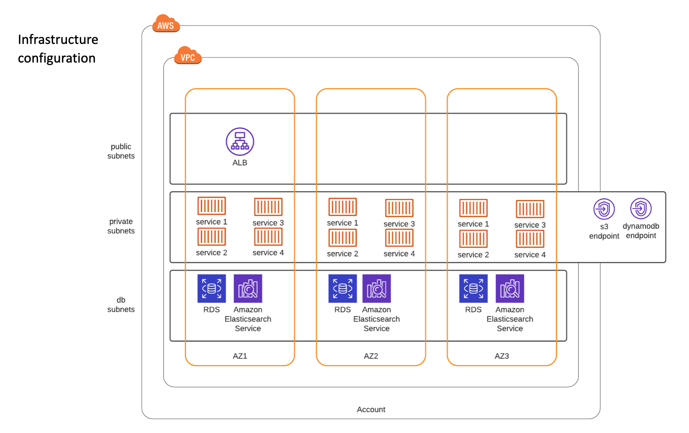

## Introduction

This repository holds Terraform files for configure a new VPC and few subnets (usually for a new AWS account), create a new ECS cluster and one demo service with its dependencies (ALB, ECR repository, Route53 records, CloudWatch Alarms, IAM and SecurityGroups).


## Repository structure:

- [application](./application) : application source code, Docker and nginx configuration files
	- `src` - simple html index page with picture and text (place application code here)
	- `Dockerfile`
	- `nginx.conf`
- [diagrams](./diagrams) : AWS infrastructure configuration & network diagram

- [infrastructure](./infrastructure): AWS infrastructure Terraform code (listed below in order of execution):
	- [network](./infrastructure/network) - using [terraform-aws-vpc](https://github.com/terraform-aws-modules/terraform-aws-vpc) Terraform module creates: VPC, Subnets, IGW & NAT Gateways, AWS service endpoints
	- [alb](./infrastructure/alb) - creates Route53 DNS zone, SSL certificate using AWS Certificate manager & validation, shared ALB to be used by ECS services, default target group and listener
	- [ecs-cluster](./infrastructure/ecs-cluster) - creates ECS cluster, AutoScaling Group, IAM role and instance profile used by the worker nodes, SecurityGroup and CloudWatch Alarms for Memory & CPU cluster reservation levels
	- [ecs-service](./infrastructure/ecs-service) - creates ECS task definition, service, role, target group and listener rule. Additionally it also creates the application ECR repository, Route53 record and CloudWatch alarms for memory and CPU utilisation


## Network Diagram




## How to deploy AWS infrastructure

1. Clone the repository

	```
	git clone git@github.com:oku86/aws_terraform.git && cd aws_terraform
	```

2. Create VPC and network configuration

	```
	cd infrastructure/network
	terraform init
	terraform apply
	```

3. Create shared Application Load Balancer and related resources

	```
	cd ../alb
	terraform init
	terraform apply
	```

4. Create ECS cluster, Auto-Scaling Group, IAM and SG resources

	```
	cd ../ecs-cluster
	terraform init
	terraform apply
	```

5. Create ECS Service configuration

	```
	cd ../ecs-service
	terraform init
	terraform apply
	```

6. Build Docker image and push to ECR repository

	```
	# Login to ECR
	aws ecr get-login-password --region eu-west-1 | docker login --username AWS --password-stdin <AWS_ACCOUNT>.dkr.ecr.eu-west-1.amazonaws.com

	# Build Docker image
	cd ../../
	docker build -t check_co application/. -f application/Dockerfile

	# Retag and push image to ECR repository
	docker tag check_co <AWS_ACCOUNT>.dkr.ecr.eu-west-1.amazonaws.com/check_co:production
	docker push <AWS_ACCOUNT>.dkr.ecr.eu-west-1.amazonaws.com/check_co:production
	```

	Note: These steps will most likely be part of an application CI/CD pipeline.


7. All done.


## How to delete AWS infrastructure

Deleting all AWS resources run `terraform destroy` in reverse order:

- ecs-service
- ecs-cluster
- alb - Note: ALB `Deletion protection` needs to be disabled
- network


## Testing ECS service

As this is just a demo using a dummy domain name `check.co` in order to test the configuration one has to manually set the `Host` header in order for the Application Load Balancer to forward the request to the right ECS service.

This can be easily achieved by using a browser plugin to override Headers like [Simple Modify Headers](https://github.com/didierfred/SimpleModifyHeaders) Chrome browser plugin or manually setting the header using `curl`:

```
$ curl -IH "Host: www.check.co" http://production-shared-alb-1234567890.eu-west-1.elb.amazonaws.com/

HTTP/1.1 200 OK
Date: Wed, 30 Dec 2020 14:41:52 GMT
Content-Type: text/html
Content-Length: 796
Connection: keep-alive
Server: nginx/1.18.0
Last-Modified: Wed, 30 Dec 2020 12:43:47 GMT
ETag: "5fec7603-31c"
Accept-Ranges: bytes                                             
```

## How to run the application locally

Run the application locally as a Docker container:

1. Clone the Github repo:

	```
	git clone git@github.com:oku86/aws_terraform.git && cd aws_terraform
	```

2. Build the Docker image:

	```
	docker build -t check_co application/. -f application/Dockerfile
	```
3. Start the Docker container:

	```
	docker run -p 127.0.0.1:80:80 -t check_co  
	```

4. Test the following URL in your browser:

	```
	http://localhost
	```


## Auto-Scaling

ECS Service will [auto-scale](./infrastructure/ecs-service/service.tf#L92-L142) when the CPU utilisation [CloudWatch alarm](./infrastructure/ecs-service/cloudwatch.tf) triggers:

- add 1 task if CPU usage > 81%
- remove 1 task if CPU usage < 60%

with a minimum of 3 tasks, a maximum of 9 and a cool down period of 5 minutes.

Using AWS S3 to serve all static content and/or [CloudFront](https://aws.amazon.com/cloudfront/) CDN distribution for caching will also significantly ease the load on the service as well as improving security when coupled with [AWS WAF](https://aws.amazon.com/waf/).


## Monitoring & Alerting

The Terraform code provides CloudWatch Alarms for ECS cluster CPU and Memory reservation levels and ECS service memory and CPU utilisation. These alarms can trigger auto-scaling of the cluster and service respectively and also send SNS notifications to alert the relevant team(s).

Additionally application uptime and performance monitoring (APM) are recommended.  
